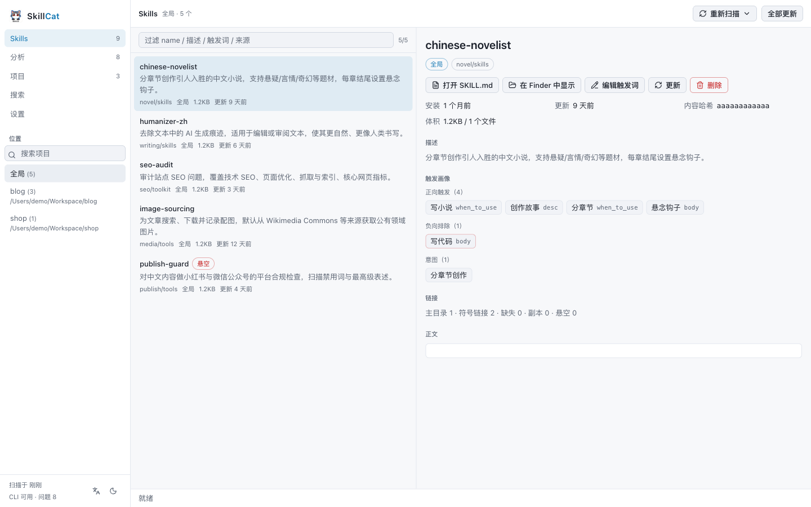
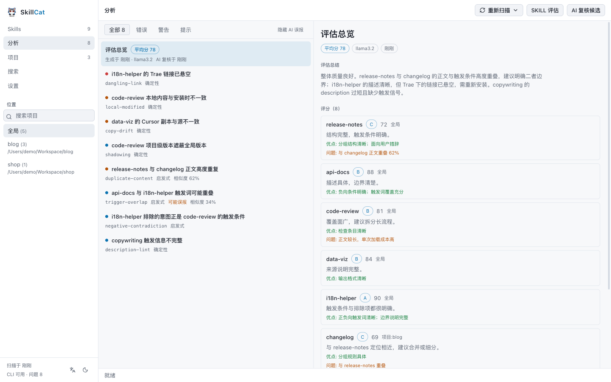
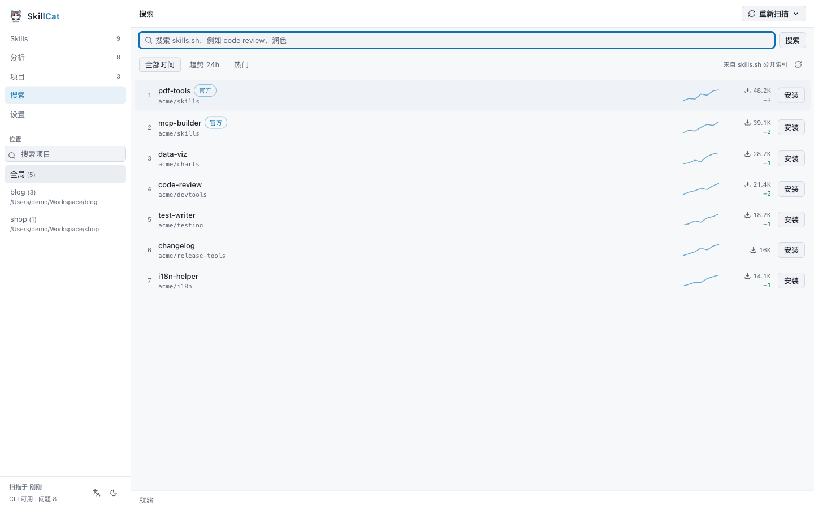
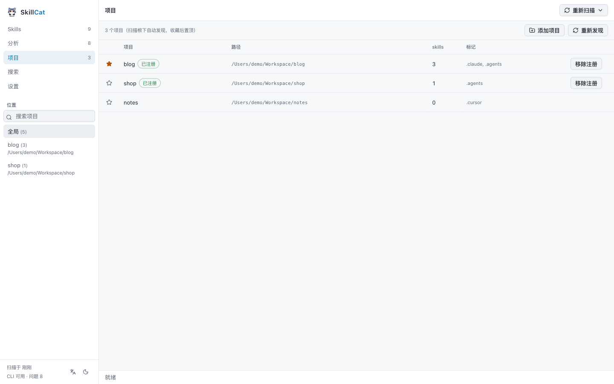
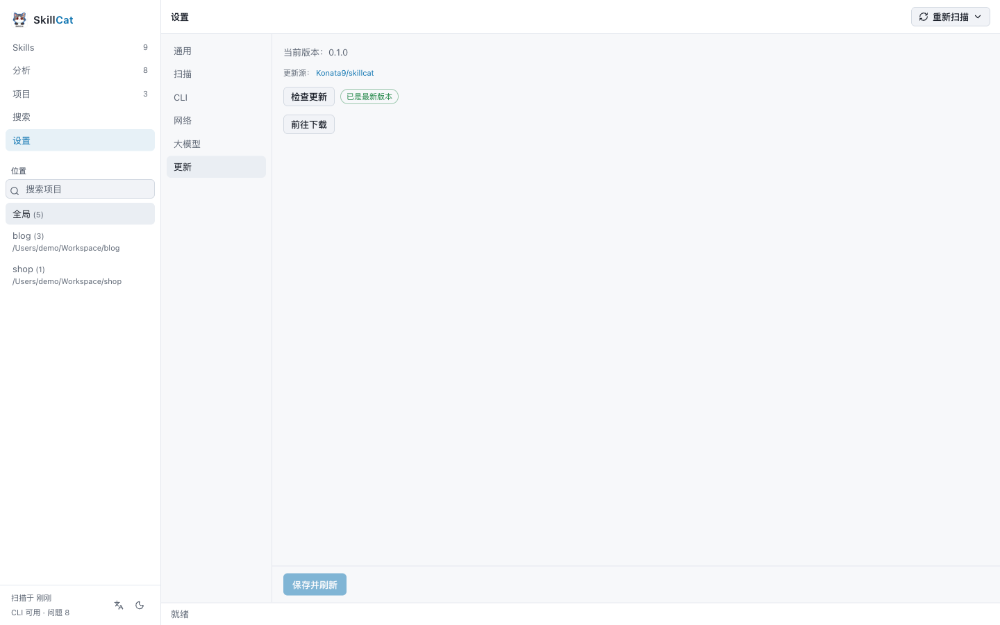

<div align="center">
  
  <h1>SkillCat</h1>
  <p><strong>本地优先的 Agent SKILL 管理器。</strong><br />
  盘点所有 skill，解释触发条件，发现安装态与语义问题，并通过官方 <code>skills</code> CLI 安全管理它们。</p>

  <p>
    <a href="LICENSE"></a>
    
    = 22" />
    
  </p>

  <p>
    <a href="README.md">English</a> · 简体中文
  </p>
</div>

---

## SkillCat 是什么？

Agent skill（SKILL.md 资源包）装起来容易，理清楚很难。它们散落在全局目录、各项目目录和十几个
agent 各自的原生目录里；彼此遮蔽；与锁文件记录的版本发生漂移；触发条件互相重叠，直到两个 skill
抢同一个请求时才被发现。

**SkillCat** 把它们全部扫出来，逐个解释，标出具体问题，并通过官方 `skills` CLI（随应用内置）完成
安装 / 更新 / 删除 / 搜索 —— 全程不背着你对文件做任何事。

- **读取本地、离线可用。** 扫描只依赖文件系统与锁文件。
- **写入全部委托。** 所有变更走官方 `skills` CLI，只有一条安装路径，不重造逻辑。
- **分析可解释。** 确定性规则与启发式规则分开标注，每条问题都附带证据。
- **AI 可选。** 自带模型密钥即可为 skill 评分，并判定重复 / 冲突候选对。

## 界面截图

**Skills** —— 全局与项目级 skill 盘点，含真实链接状态、触发画像与文件详情。



| 分析 | 远程搜索 |
| --- | --- |
|  |  |

| 项目 | 设置与更新 |
| --- | --- |
|  |  |

## 功能

- **库存盘点** —— 覆盖 90+ 已知 agent（Claude Code、Codex、Cursor、OpenCode、Gemini CLI、
  Windsurf、Trae 等）的全局与项目级 skill，含来源、锁文件元数据与真实链接状态
  （符号链接 / 悬空 / 副本漂移）。
- **触发画像** —— 从 `when_to_use`、`dispatch_intent`、description 及正文 "When to Use / 触发"
  小节提取正向与负向触发词；支持人工标注（sidecar 存储，不修改 skill 目录）。
- **问题分析** —— 确定性规则（悬空链接、锁记录缺失、副本漂移、本地修改、跨作用域遮蔽、来源冲突）
  加启发式规则（触发词重叠、负向矛盾、正文重复、description 缺失触发信号）。
- **AI 评估**（可选）—— 用你自己的模型为每个 skill 评分，并判定预筛选出的重复 / 冲突候选对；
  结果会保存，并与规则问题一同展示。
- **项目发现** —— 按 agent marker 在扫描根下自动发现项目，可收藏与快速回访。注册表只存路径，
  删除条目不会删除文件。
- **远程榜单与搜索** —— 浏览 skills.sh 榜单（全部时间 / 趋势 / 热门）并搜索公开索引，
  选中后直接安装到当前作用域。
- **安全操作** —— 所有变更通过底部抽屉流式显示进度，带二次确认，可随时取消。
- **桌面体验** —— 亮色 / 暗色双主题、中文 / English 界面（默认跟随系统语言）、代理支持，
  以及诊断工具 doctor。

## 安装

### 环境要求

- **macOS** —— 自带运行时，内置 `skills` CLI，**无需安装 Node.js**
- **Windows** —— 需要安装 [Node.js](https://nodejs.org/) ≥ 22（内置 CLI 目前仅 macOS）
- 从源码构建需要 [Node.js](https://nodejs.org/) ≥ 22 与 [pnpm](https://pnpm.io/) 11

### 方式一 —— 下载应用

从 [Releases](https://github.com/Konata9/skillcat/releases) 页面下载最新版本：

- **macOS** —— `SkillCat-<version>-arm64.dmg` 或 `SkillCat-<version>-x64.dmg`（Apple Silicon / Intel），
  把 **SkillCat** 拖入 `/Applications`。
- **Windows** —— `SkillCat-<version>-setup.exe`，运行安装程序即可。安装 / 更新 skill 会使用系统
  的 Node.js（见[环境要求](#环境要求)）。

产物未签名。macOS 上 Gatekeeper 会拦截首次打开，可右键 → **打开**，或清除隔离属性（应用位于
`/Applications` 需要 `sudo`）：

```bash
sudo xattr -dr com.apple.quarantine /Applications/SkillCat.app
```

Windows 上 SmartScreen 可能提示未知发布者，选择 **更多信息 → 仍要运行**。

### 方式二 —— 从源码构建

```bash
git clone https://github.com/Konata9/skillcat.git
cd skillcat
pnpm install
pnpm desktop   # Electron 桌面端（开发模式）
```

首次运行请设置扫描根目录（例如 `~/Workspace`），用于自动发现项目级 skill。

打包为可分发的独立应用（产出到 `apps/desktop/release/`），按目标平台执行对应脚本（`pnpm dist`
则构建当前平台）：

```bash
pnpm dist:mac   # macOS：dmg + zip（Apple Silicon 与 Intel）
pnpm dist:win   # Windows：x64 NSIS 安装包
```

<details>
<summary>网络受限？使用镜像。</summary>

```bash
# 安装依赖
ELECTRON_MIRROR=https://npmmirror.com/mirrors/electron/ \
  pnpm install --registry=https://registry.npmmirror.com/

# 打包
ELECTRON_MIRROR=https://npmmirror.com/mirrors/electron/ \
ELECTRON_BUILDER_BINARIES_MIRROR=https://npmmirror.com/mirrors/electron-builder-binaries/ \
  pnpm dist
```

</details>

## 文档

架构、设计取舍与参考资料都在 [`docs/`](docs/)：

| 文档 | 内容 |
| --- | --- |
| [docs/architecture.md](docs/architecture.md) | Core + UI 架构、仓库结构、进程与 IPC、构建与打包 |
| [docs/design.md](docs/design.md) | 读写分离、统一身份、作用域模型、分析分级 |
| [docs/analysis-rules.md](docs/analysis-rules.md) | 完整的确定性 / 启发式规则表 |
| [docs/ai-evaluation.md](docs/ai-evaluation.md) | LLM 评分、候选对判定、模型供应商与远程榜单 |
| [docs/configuration.md](docs/configuration.md) | 配置与数据位置、`config.json` 字段、代理、迁移 |
| [docs/development.md](docs/development.md) | 开发命令、项目结构、测试、新增 agent |
| [docs/troubleshooting.md](docs/troubleshooting.md) | 已知限制与常见问题 |

## 参与贡献

欢迎提交 issue 与 pull request。提交 PR 前请先运行：

```bash
pnpm typecheck
pnpm test
```

## 许可证

[MIT](LICENSE) © 2026 konata9
